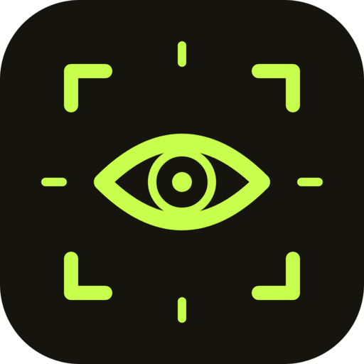

# Peek

Point at a DOM node in your real browser. Grok Build, Claude Code, Codex, and Cursor get the selector, a slice of HTML, and a cropped screenshot.

This is not a browser-driving agent. You pick. The model looks.

## Install

```bash
brew tap iammayron/tap
brew install peek
```

Or from this repo:

```bash
make install
# or
curl -fsSL https://raw.githubusercontent.com/iammayron/peek/main/install.sh | sh
```

Then:

1. Install the extension from the [Chrome Web Store](https://chromewebstore.google.com/detail/peek/afalnlminndnlfgnlphbelelpcblcbld)
2. Press **Alt+Shift+P** (or click the toolbar icon), click an element
3. In the agent: “look at this” / “this button is overflowing”

Working on Peek itself? `make install` runs `peek install --dev`, which prints an
unpacked extension dir to load from `chrome://extensions` with Developer mode on.

`peek doctor` tells you if the daemon, native host, and last pin are healthy.

## Website

The public landing lives in [`website/`](website/) and deploys as a static export to [peek.mayronalves.com](https://peek.mayronalves.com) on Cloudflare Pages (root directory `website`). Next.js and Remotion stay isolated there; the Go Makefile is unchanged.

## Commands

| | |
|---|---|
| `peek install [--dev]` | Native host, launchd/systemd, MCP, skills |
| `peek doctor` | Status |
| `peek latest [--md]` | Current pin |
| `peek wait` | Block until the next click (also arms the overlay) |
| `peek mcp` | stdio MCP server |

## Privacy

Everything stays on localhost. Pins live in `~/.peek/` (mode `0600`). No telemetry.

## Chrome Web Store

v1 is load-unpacked. A store listing is what makes the extension itself one-click; the native host still comes from brew/`install.sh`.
